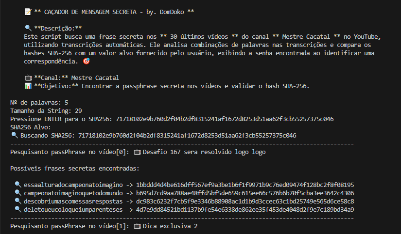
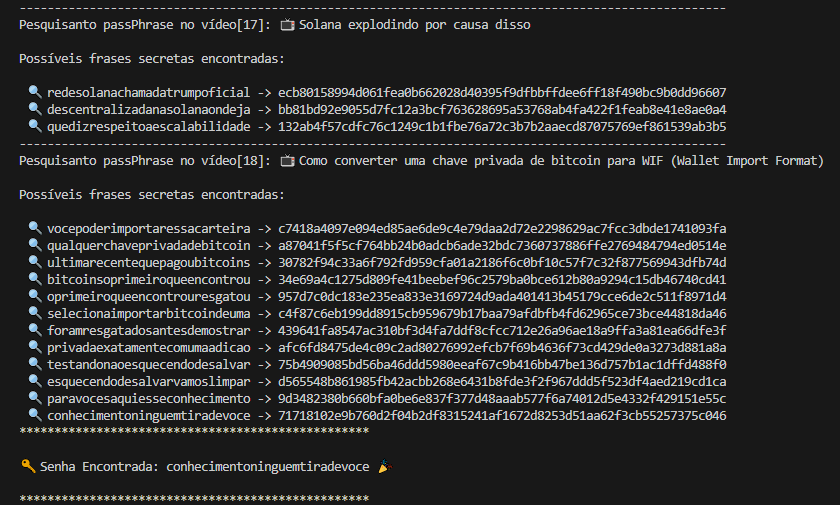

# 📝 **Caçador de Senha** - Script para encontrar passphrases secretas

Este script tem como objetivo buscar frases secretas nos **30 últimos vídeos** do canal **Mestre Cacatal** no YouTube. Ele utiliza transcrições automáticas para analisar combinações de palavras e comparar os hashes SHA-256 com um valor alvo fornecido pelo usuário. O script exibe a senha encontrada ao identificar uma correspondência.

## 🛠️ **Funcionalidades**

- **Busca de Passphrases:** O script analisa as transcrições dos vídeos para encontrar combinações de palavras que podem formar a passphrase secreta.
- **Validação SHA-256:** Compara os hashes SHA-256 das passphrases encontradas com o hash fornecido pelo usuário.
- **Busca nos últimos vídeos:** O script obtém os **30 últimos vídeos** do canal **Mestre Cacatal** e busca pelas passphrases.

## 📹 **Canal: Mestre Cacatal**
O script busca nas transcrições dos vídeos do canal **Mestre Cacatal**. Confira o canal no [YouTube](https://www.youtube.com/@mestrecacatal/videos).

## 🔧 **Como Usar**


1. **Requisitos:**
   - Python 3.x
   - Bibliotecas: `youtube_transcript_api`, `requests`

2. **Instalação das dependências:**
   
   ```bash
   pip install youtube_transcript_api requests
📸 Exemplos de Execução
Aqui estão alguns exemplos de como o script interage com o usuário e as possíveis saídas.

Exemplo 1: Interação com o Usuário

O script solicita os parâmetros do usuário (número de palavras, tamanho da string e hash SHA-256 alvo).


Exemplo 2: Busca e Encontrando a Passphrase

Após processar os vídeos, o script exibe as passphrases encontradas e valida se algum hash corresponde ao hash alvo.


💻 Estrutura do Script
Funções
imprimir_descricao(): Exibe uma breve descrição sobre o funcionamento do script.
clean_string(text): Remove acentos, caracteres especiais e números das transcrições.
get_video_id(url): Extrai o ID do vídeo a partir da URL.
get_transcription(video_id): Obtém a transcrição do vídeo.
check_string(lista_palavras, number_words, len_string): Verifica combinações de palavras nas transcrições.
Fluxo Principal
O script solicita ao usuário os parâmetros necessários (número de palavras, tamanho da string e hash SHA-256 alvo).
O script então acessa os vídeos mais recentes do canal Mestre Cacatal e busca pelas passphrases secretas nas transcrições dos vídeos.
Quando uma passphrase com o hash correspondente ao hash alvo é encontrada, o script exibe a senha secreta.
🤝 Contribuições
Se você gostaria de contribuir com melhorias para este projeto, sinta-se à vontade para abrir uma issue ou pull request.

📝 Licença
Este projeto é licenciado sob a licença MIT - veja o arquivo LICENSE para mais detalhes.
